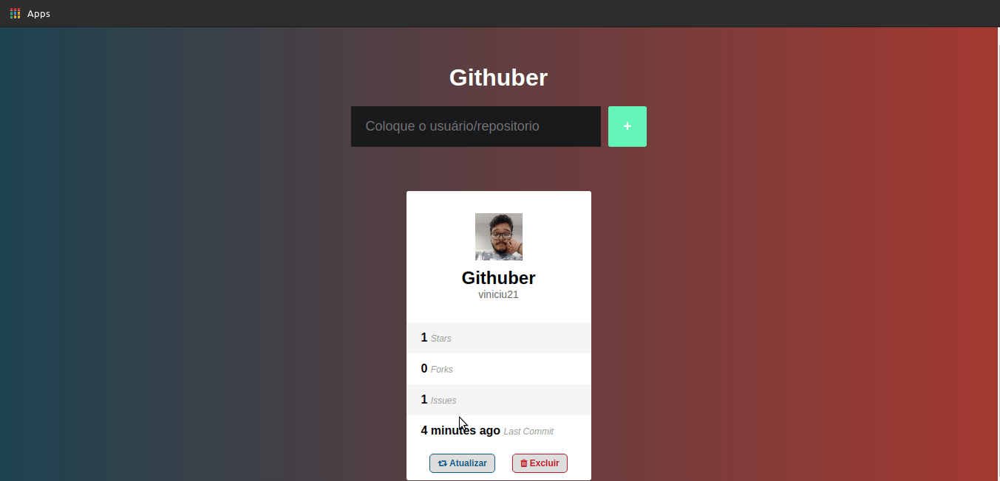
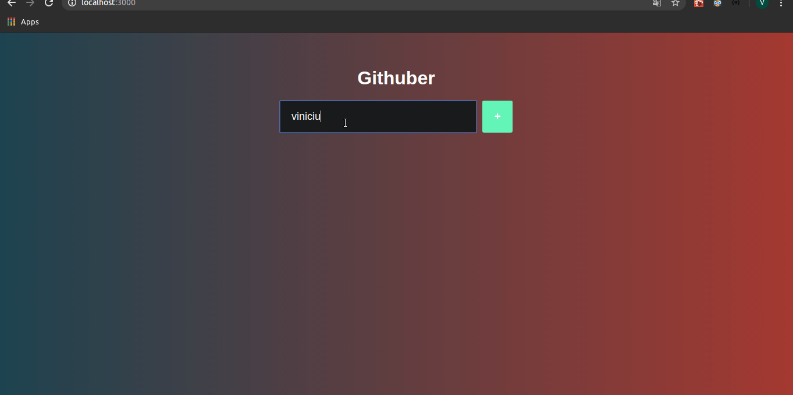

# Githuber
App para ver informações de repositorios do github.

# Funcionalidades

O app usa o sessionStorage para guardar informações sobre os repositorios que você quer guardar enquanto a aba não for fechada.

O app pode atualizar as informações dos repositórios quando apertar em Atualizar, e pode ser apagador apertando em excluir.

